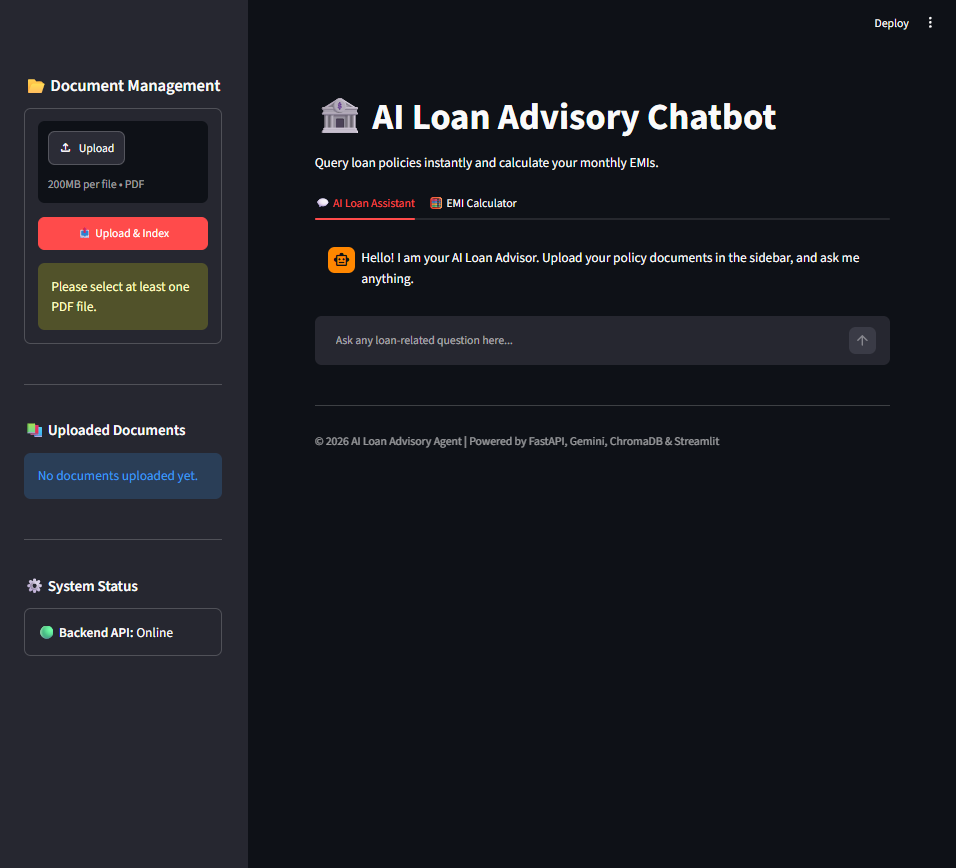
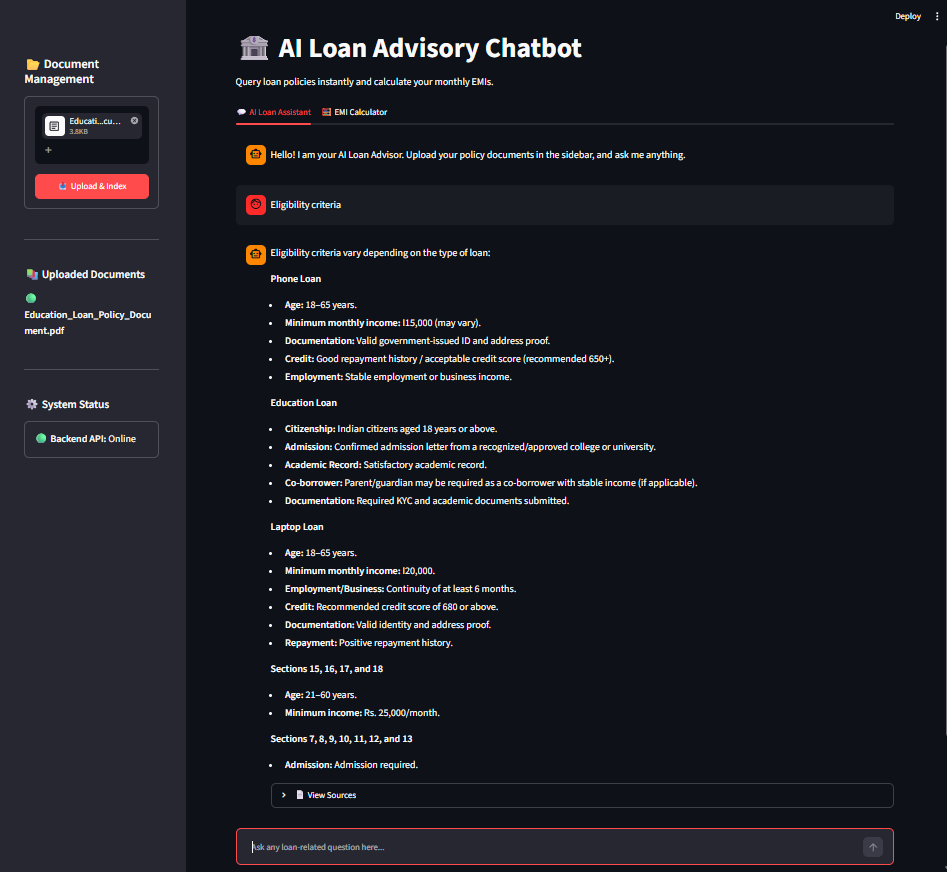
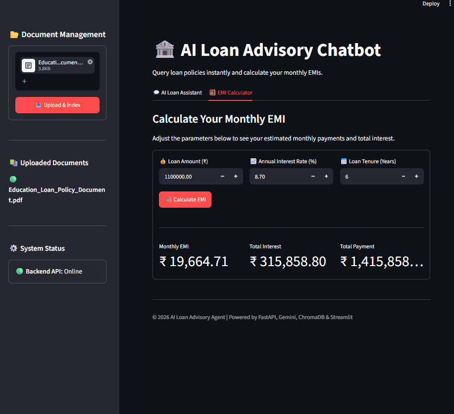

# 🏦 AI Loan Advisory Chatbot

An AI-powered Loan Advisory Chatbot that allows users to upload loan policy PDFs, ask natural language questions, and receive accurate answers grounded in the uploaded documents using **Retrieval-Augmented Generation (RAG)**.

The application also includes an **EMI Calculator** for instant loan repayment estimation.

---

## 📸 Project Preview

> Add screenshots here after uploading to GitHub.

### Home Page



### Chat Interface



### EMI Calculator



---

# ✨ Features

- 📄 Upload one or multiple Loan Policy PDFs
- 🤖 AI-powered Question Answering using Gemini
- 📚 Retrieval-Augmented Generation (RAG)
- 🔍 Semantic Search using ChromaDB
- 🧠 Google Gemini Embeddings
- 📑 Source Citation (PDF + Page Number)
- 🧮 EMI Calculator
- 💬 Interactive Chat Interface
- ⚡ FastAPI Backend
- 🎨 Streamlit Frontend
- 🐳 Docker Support
- 🔒 Environment Variable Support (.env)

---

# 🛠 Tech Stack

### Frontend

- Streamlit

### Backend

- FastAPI
- Uvicorn

### AI & RAG

- Google Gemini API
- LangChain
- ChromaDB
- GoogleGenerativeAIEmbeddings

### PDF Processing

- PyMuPDF (fitz)

### Programming Language

- Python 3.13

---

# 📂 Project Structure

```text
AI-Loan-Advisory-Chatbot
│
├── backend
│   ├── chatbot.py
│   ├── config.py
│   ├── loan_utils.py
│   ├── main.py
│   ├── models.py
│   ├── pdf_processor.py
│   └── rag.py
│
├── frontend
│   ├── app.py
│   ├── api.py
│   └── __init__.py
│
├── tests
│   ├── test_api.py
│   ├── test_chatbot.py
│   ├── test_loan.py
│   └── test_pdf.py
│
├── documents
├── chroma_db
│
├── Dockerfile
├── docker-compose.yml
├── requirements.txt
├── README.md
├── .env.example
├── .gitignore
└── LICENSE 
```

---

# ⚙️ Installation

## 1. Clone Repository

```bash
git clone https://github.com/YOUR_USERNAME/AI-Loan-Advisory-Chatbot.git

cd AI-Loan-Advisory-Chatbot
```

---

## 2. Create Virtual Environment

Windows

```bash
python -m venv .venv

.venv\Scripts\activate
```

Linux / macOS

```bash
python3 -m venv .venv

source .venv/bin/activate
```

---

## 3. Install Dependencies

```bash
pip install -r requirements.txt
```

---

## 4. Configure Environment Variables

Create a `.env` file in the project root.

```env
GOOGLE_API_KEY=YOUR_GEMINI_API_KEY
```

---

# ▶️ Running the Application

## Start Backend

```bash
uvicorn backend.main:app --reload
```

Backend runs at

```
http://127.0.0.1:8000
```

Swagger API

```
http://127.0.0.1:8000/docs
```

---

## Start Frontend

Open another terminal

```bash
streamlit run frontend/app.py
```

Frontend

```
http://localhost:8501
```

---

# 🐳 Docker

Build

```bash
docker compose build
```

Run

```bash
docker compose up
```

Stop

```bash
docker compose down
```

---

# 🚀 Workflow

```text
Upload PDF
      │
      ▼
Extract Text
      │
      ▼
Chunk Documents
      │
      ▼
Generate Gemini Embeddings
      │
      ▼
Store in ChromaDB
      │
      ▼
Semantic Retrieval
      │
      ▼
Gemini LLM
      │
      ▼
Answer + Source Citation
```

---

# 📚 API Endpoints

| Method | Endpoint | Description |
|---------|----------|-------------|
| GET | `/health` | Backend Health |
| POST | `/upload` | Upload & Index PDFs |
| POST | `/chat` | Ask Questions |
| POST | `/emi` | Calculate EMI |
| GET | `/documents` | List Uploaded Documents |
| POST | `/reindex` | Rebuild Vector Database |

---

# 📈 Future Improvements

- Conversation Memory
- Loan Eligibility Prediction
- Loan Comparison
- OCR Support for Scanned PDFs
- Voice Input
- Multilingual Support
- Admin Dashboard
- Authentication
- Cloud Deployment

---

# 📄 Environment Variables

Create a `.env` file.

```env
GOOGLE_API_KEY=YOUR_GEMINI_API_KEY
```

Never upload your real API key to GitHub.

---

# 🤝 Contributing

Contributions, issues, and feature requests are welcome.

Feel free to fork this repository and submit a pull request.

---

# 👨‍💻 Author

**Deepak Kumar Saini**

B.Tech CSE (Artificial Intelligence)

AI/ML | Generative AI | Python | FastAPI | LangChain

GitHub: https://github.com/Deepak969686

LinkedIn: https://linkedin.com/in/deepakkumarji

---

# ⭐ If you like this project

Please consider giving it a ⭐ on GitHub.
